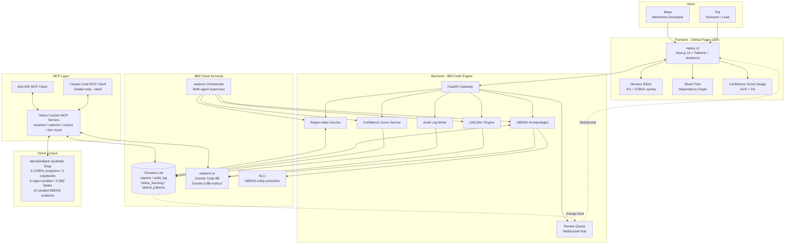
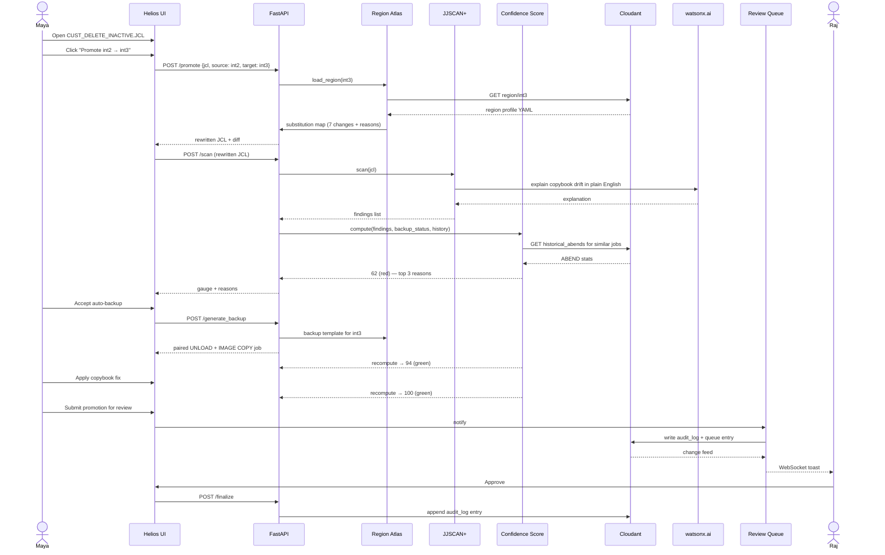
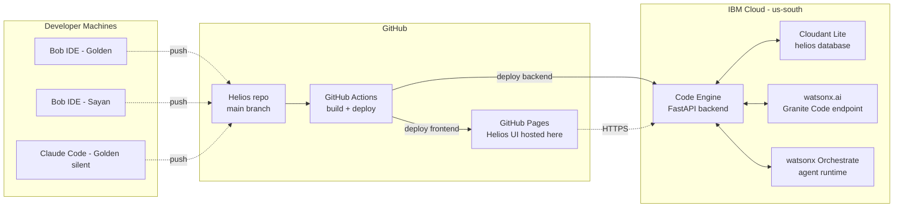

# Architecture

## System Architecture Diagram

## Component breakdown

### Frontend (Sayan)

Single-page Next.js app exported as static HTML, served from GitHub Pages. No SSR — keeps deployment free and trivial.

**Key UI surfaces:**
- **Studio** — JCL / COBOL editor with the region picker, JJSCAN+ panel, Confidence Score gauge
- **Atlas** — region profile manager, side-by-side YAML diff view (this is the hero shot for the demo)
- **Archaeology** — ABEND dump paste box, traced source view, runbook generator
- **Review Queue** — real-time list of pending promotions, WebSocket-driven
- **Audit** — append-only log viewer with filters

**Conventions:**
- Tailwind for styling; shadcn/ui for primitives; lucide-react for icons
- Monaco editor with custom JCL/COBOL syntax definitions (we ship these in `frontend/lib/monaco-langs/`)
- React Flow for dependency graphs; Mermaid for call graphs
- D3 for the Confidence Score gauge (custom SVG, animates on score change)

### Backend (Golden)

FastAPI app on Code Engine. Async throughout — `httpx` for outbound, `aiocouch` for Cloudant, `websockets` for the Review Queue hub.

**Service modules:**
- `services/atlas/` — region profile CRUD, promote-job logic, backup job generator
- `services/jjscan/` — dependency resolver, static rule engine, COBOL/JCL parser glue
- `services/abend/` — pattern matcher, dump parser, COBOL traceback, runbook synthesizer
- `services/score/` — Confidence Score formula, weight loader
- `services/audit/` — append-only writer, query API
- `services/review/` — WebSocket hub, Cloudant change-feed consumer

**Library glue:**
- `proleap-cobol-parser` for COBOL AST (Java; called via subprocess or rewritten as a small companion service)
- `koopa-cobol-parser` as a pure-Python fallback for lighter parsing
- Custom JCL parser (~400 lines, hand-written — JCL is too irregular for off-the-shelf grammars)

### MCP Layer

Two clients, four custom servers.

**Clients:**
- **Bob IDE MCP** — both Golden and Sayan. Reads `.bob/mcp.json` from the workspace.
- **Claude Code MCP** — Golden only, silent backup. Reads `~/.claude/mcp.json` (per-user, not in repo).

**Off-the-shelf servers loaded by both clients:**
- `@modelcontextprotocol/server-github` — repo ops, PRs, issues
- `@modelcontextprotocol/server-filesystem` — sandbox to project folder
- `@modelcontextprotocol/server-memory` — persistent context across Bob sessions
- `mcp-server-fetch` — for pulling open-source COBOL repos and IBM docs

**Custom Helios servers (we build these):**
- `mcp-servers/ibm-cloud/` — wraps `ibmcloud` CLI for one-shot Code Engine and Cloudant ops
- `mcp-servers/cloudant/` — CRUD against Cloudant from inside Bob without leaving the IDE
- `mcp-servers/watsonx/` — direct Granite Code 8B inference for COBOL/JCL tasks
- `mcp-servers/helios-corpus/` — exposes the MeridianBank synthetic shop as a queryable resource

Full setup in [`MCP_SETUP.md`](MCP_SETUP.md).

### IBM Cloud Services

| Service | Tier | Purpose | Cost |
|---|---|---|---|
| Code Engine | Free (100k req/mo) | Backend hosting | $0 within hackathon limits |
| Cloudant Lite | Free (1 GB) | All persistent state | $0 |
| watsonx.ai | $80 hackathon credits | Granite Code 8B inference | ~$0.0001 per 1K tokens |
| watsonx Orchestrate | hackathon-provisioned | Multi-agent orchestration | included |
| NLU Lite | Free (30k items/mo) | ABEND entity extraction | $0 |
| STT/TTS | Free (Lite tier) | Optional voice demo | $0 |

Full inventory in [`TOOLS_AND_SERVICES.md`](TOOLS_AND_SERVICES.md).

## Data flow — promote-job scenario

The single most important user flow. Maya promotes a JCL from int2 to int3.

## Deployment topology

## Security boundary

The trust boundary lives at the FastAPI gateway. Three classes of secret:

1. **In-browser** — none. The frontend is fully static; it talks to the backend over HTTPS and that's it.
2. **In Code Engine** — Cloudant credentials, watsonx API key, watsonx project ID. Stored as Code Engine secrets, mounted as env vars.
3. **On developer machines** — IBM Cloud API key, GitHub PAT, watsonx API key (for local Bob/Claude Code MCP servers). Stored in shell env vars only. Never in `.bob/mcp.json`, never in `.env` checked into the repo.

Full rules in [`SECURITY.md`](SECURITY.md).

## Why this architecture

A few non-obvious choices and their rationale:

**Static frontend on GitHub Pages.** Cheapest, fastest, zero ops. Backend can scale independently; frontend never goes down. Free tier covers anything the demo can throw at it.

**Cloudant over a SQL database.** Region profiles are heterogeneous (different shops will track different fields). JSON-native storage avoids the schema-migration treadmill. Cloudant's change feed is also what powers the real-time Review Queue with no extra infrastructure.

**Granite Code 8B, not 70B.** Smaller models are faster and cheaper, and Granite Code 8B is genuinely strong on COBOL — IBM trained it on the same corpora that power Watson Code Assistant for Z. Using a banned model would tank our judging score.

**Custom MCP servers in TypeScript.** Bob and Claude Code both speak MCP. Writing four small TS servers gives both clients identical access to Cloudant, watsonx, and the corpus. No duplicate glue code.

**No mainframe access.** We don't have a real LPAR. Trying to fake one would consume the entire hackathon. Instead we build a high-fidelity synthetic shop (MeridianBank) using GnuCOBOL test suite + opensourcecobol/Bankdemo as the COBOL source, run JCL through our parser without executing it, and stage SMF-shaped synthetic events for the anomaly demo. Judges who know mainframes will recognize the corpus quality immediately.
