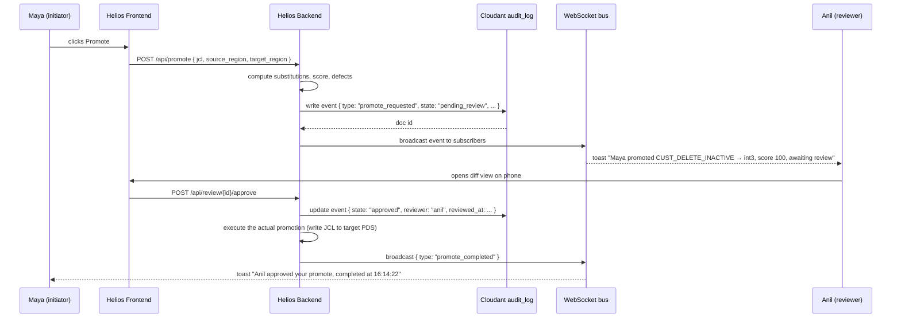

# Review Queue — Real-time Two-Developer Feature

## Purpose

The Review Queue is Helios's signature two-developer feature. When one developer initiates a meaningful change (promote a job, edit a region profile, accept a JJSCAN+ finding, override a Confidence Score), the other developer sees it appear in real time on their Helios screen, can inspect it, and can approve or reject it from anywhere — including their phone.

This is the feature that makes Helios feel like a team product rather than a single-user tool. It is also our single best demo flourish for showcasing that we are a two-person hackathon team building a team product.

## Why this matters

Real mainframe shops require approval before any production-bound change. Today this is done via:

- A Slack message and a screenshot (no audit, no provenance)
- An email to the team lead (slower than the change itself)
- A Jira ticket created out of band (loses context)

None of these are linked to the artifact being changed, none capture the system state at approval time, and none survive an auditor's question two quarters later.

The Review Queue replaces all three with a single primitive: every state-changing action emits an event, the event lives in Cloudant with full before/after context and the active Confidence Score, and reviewers approve or reject from a queue that updates in real time.

## High-level flow



Latency target: from initiator click to reviewer notification is **under 1 second** on the demo network.

## What triggers a Review Queue event

Five action types create events. Each can be marked `auto_approve` or `requires_review` per region in the region profile:

| Action | Default in dev regions | Default in prod region |
|---|---|---|
| `region_profile_edit` | auto | review |
| `promote_job` | auto if score ≥ 90 | always review |
| `accept_jjscan_finding_dismissal` | auto | review |
| `confidence_score_override` | review | review (with reason) |
| `runbook_publish` | auto | auto |

These defaults live in `config/review_queue_defaults.yaml` and are also editable in the UI under Settings.

## Event document shape (Cloudant `helios_audit_log`)

```json
{
  "_id": "evt:2026-10-23T16:12:03.114Z:promote:01HXY...",
  "type": "promote_requested",
  "actor": "maya@meridianbank.demo",
  "actor_role": "developer",
  "ts": "2026-10-23T16:12:03.114Z",
  "subject": {
    "kind": "jcl",
    "name": "CUST_DELETE_INACTIVE.JCL",
    "source_region": "int2",
    "target_region": "int3"
  },
  "before_sha256": "a3f9...",
  "after_sha256":  "c1b7...",
  "before_blob_ref":  "blob:int2/CUST_DELETE_INACTIVE.JCL@a3f9...",
  "after_blob_ref":   "blob:int3-staged/CUST_DELETE_INACTIVE.JCL@c1b7...",
  "diff": [
    { "field": "STEPLIB DSN", "from": "CUST.INT2.LOAD", "to": "CUST.INT3.LOAD", "reason": "region_atlas_substitution" },
    { "field": "DSN SYSTEM", "from": "DBI2", "to": "DBI3", "reason": "region_atlas_substitution" }
    // ... 5 more
  ],
  "confidence_score": 100,
  "confidence_breakdown": {
    "jjscan_findings": [],
    "region_mismatch_penalty": 0,
    "backup_gap_penalty": 0,
    "historical_abend_penalty": 0,
    "spec_match_bonus": 10
  },
  "auto_fixes_applied": [
    { "fix": "generate_paired_backup", "target": "CUST.INT3.BKP.D26296.T161203" },
    { "fix": "update_syslib_for_copybook_drift", "from": "v2.7", "to": "v3.1" }
  ],
  "state": "pending_review",
  "reviewer": null,
  "review_decision": null,
  "review_reason": null,
  "reviewed_at": null,
  "completed_at": null,
  "client_meta": {
    "user_agent": "Bob IDE/1.2.0 helios-extension/0.4.1",
    "ip_hash": "sha256:..."
  }
}
```

After review:

```json
{
  ...,
  "state": "approved",
  "reviewer": "anil@meridianbank.demo",
  "reviewer_role": "team_lead",
  "review_decision": "approve",
  "review_reason": "score=100, backup staged, copybook resolved",
  "reviewed_at": "2026-10-23T16:14:18.502Z",
  "completed_at": "2026-10-23T16:14:22.901Z"
}
```

This document is **append-only** — once written, it is never edited destructively. Updates create a new revision; the full revision history is the audit trail.

## Real-time delivery

- Backend subscribes to Cloudant `_changes` feed with `feed=continuous&filter=audit_log/pending_review`.
- Each change is broadcast over a single WebSocket on `wss://<backend>/ws/queue`.
- Frontend subscribes per-user; the WebSocket server filters events the user is allowed to see (RBAC at the broadcast layer).
- Reconnection is automatic with the standard exponential-backoff pattern; missed events are replayed via `GET /api/queue?since=<lastSeq>`.

We deliberately use **one** WebSocket connection per user, not one per artifact. Mainframe shops have 100+ active artifacts at once; a connection-per-thing pattern would melt browsers.

## UI surfaces

### Initiator view

After clicking Promote, the score panel transitions to:

```
[ Pending review by Anil — 00:14 elapsed ]
[ Cancel request ]
```

The user can keep working; a non-blocking toast appears when the review completes.

### Reviewer view

A persistent badge on the Helios sidebar shows pending count: `Review (2)`. Clicking opens the queue:

```
┌──────────────────────────────────────────────────────────┐
│ Review Queue                                              │
├──────────────────────────────────────────────────────────┤
│ ⓘ  Maya • promote • CUST_DELETE_INACTIVE → int3          │
│    Score 100 • 0 critical findings • 2 auto-fixes         │
│    [ View diff ] [ Approve ] [ Reject ]      00:14 ago    │
├──────────────────────────────────────────────────────────┤
│ ⓘ  Raj • region edit • int1.yaml  (BIND params changed)   │
│    Score N/A • requires review (prod-similarity)           │
│    [ View diff ] [ Approve ] [ Reject ]      02:11 ago    │
└──────────────────────────────────────────────────────────┘
```

Clicking **View diff** opens a Monaco-powered side-by-side. Clicking **Approve** or **Reject** sends the API call and instantly updates the queue.

### Mobile

The reviewer view is responsive and works fine on a phone in portrait. We do not ship a separate mobile app for the hackathon — the responsive web view is the demo.

## RBAC — who can review what

Defined in the region profile under `review.allowed_reviewers`:

```yaml
review:
  allowed_reviewers:
    promote_job:
      - role: team_lead
      - role: senior_developer
    region_profile_edit:
      - role: team_lead
    confidence_score_override:
      - role: team_lead
      - reason_required: true
```

The initiator can never review their own request. (Soft-enforced in UI, hard-enforced in backend.)

## Bypass — when the queue would slow you down

In dev regions or for non-protected resources, the queue auto-approves and the event is still written to the audit log marked `auto_approved: true` with the policy that allowed it. This is the difference between *no review trail* (today) and *review trail with explicit auto-approve policy* (Helios). Auditors will love this.

## Demo rehearsal — the split-screen moment

In the live demo, the laptop runs Maya's view. A second device — either Sayan's laptop signed in as Anil, or a phone mirrored to the projector — shows Anil's view. When Maya clicks Promote, the toast on Anil's device appears within 800 ms. That moment is the visual proof that Helios is a multi-developer product. Rehearse this transition until it is smooth.

## What we are NOT building for the hackathon

- Slack/Teams notification fan-out (mentioned as a Phase 2 webhook in `docs/ROADMAP.md`)
- Email digest of pending reviews (Phase 2)
- SLA-based auto-escalation if a review sits for >N minutes (Phase 2)
- Mobile push notifications via APNs/FCM (Phase 3)

The in-browser toast and the queue badge cover the demo and tell the right product story.

## Implementation pointers

| Concern | File | Owner |
|---|---|---|
| WebSocket server | `backend/api/ws_queue.py` | Golden |
| Cloudant change-feed listener | `backend/services/audit_listener.py` | Golden |
| Event writer (called by every state-changing endpoint) | `backend/services/audit_writer.py` | Golden |
| Frontend WebSocket hook | `frontend/lib/useReviewQueue.ts` | Sayan |
| Queue UI | `frontend/components/ReviewQueue.tsx` | Sayan |
| Diff viewer | `frontend/components/DiffViewer.tsx` (Monaco) | Sayan |
| Mobile responsive layout | `frontend/styles/queue.css` | Sayan |

Hard dependency: `backend/services/audit_writer.py` and the Cloudant `helios_audit_log` schema must land before any state-changing endpoint can be merged. This is the first ticket in `docs/PHASE_PLAN.md` Phase 2.

## Demo failure mitigation

If the WebSocket fails on demo day, the queue still works — the frontend polls `/api/queue?since=<lastSeq>` every 3 seconds as fallback. The judge will see at most a 3-second delay instead of sub-second; the demo still lands. Always test the polling fallback before the demo, not the WebSocket.
